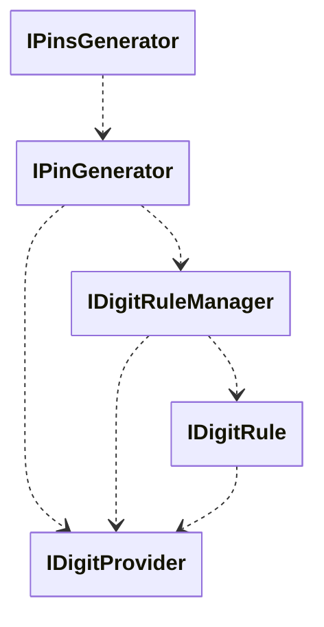

# Interface Dependencies

```mermaid
---
config:
  class:
    hideEmptyMembersBox: true
---
classDiagram
    class IPinsGenerator
    class IPinGenerator
    class IDigitRuleManager
    class IDigitProvider
    class IDigitRule
    
    IPinsGenerator ..> IPinGenerator
    IPinGenerator ..> IDigitRuleManager
    IPinGenerator ..> IDigitProvider
    IDigitRuleManager ..> IDigitRule
    IDigitRuleManager ..> IDigitProvider
    IDigitRule ..> IDigitProvider
```